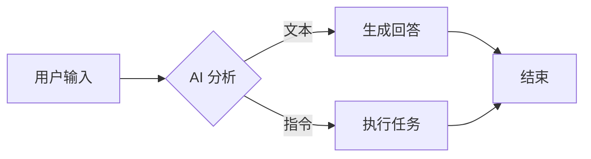

## Mermaid（事实标准）

https://mermaid.js.org/

## PlantUML

https://plantuml.com/zh/

## Hello with Header2

- **Bold 文字**
- ~~横杠叉掉~~
- [ ] 待办 TODO
- [x] 待办 TODO

## 优点，缺点和现状

- 优点：维护逻辑内容，把可视化这个工作都交给工具了，不需要操心布局，色彩等等
- 缺点：无法操心布局，色彩等等，不如意的时候也不好改
- 现状：理解，并等等。（drawio？）