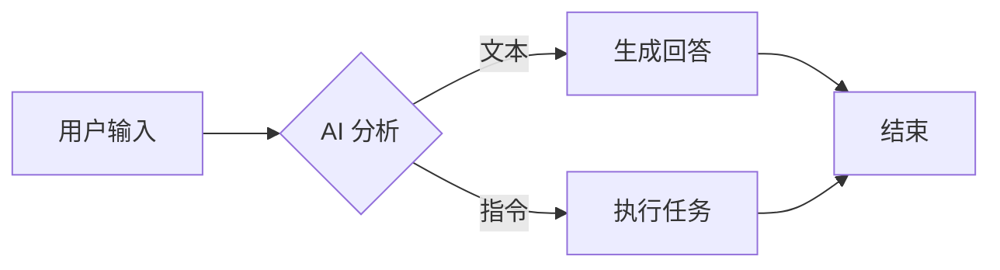

Hello

## Hello with Header2

- **Bold 文字**
- ~~横杠叉掉~~
- [ ] 待办 TODO
- [x] 待办 TODO

```mermaid
graph LR
    A[用户输入] --> B{AI 分析}
    B -->|文本| C[生成回答]
    B -->|指令| D[执行任务]
    C --> E[结束]
    D --> E
```